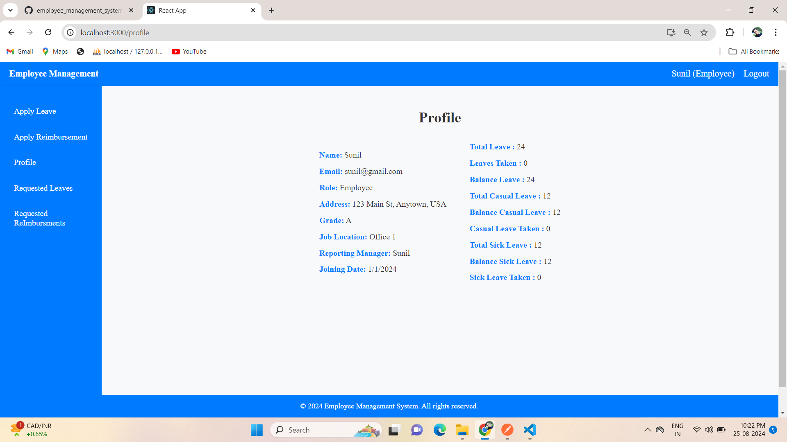
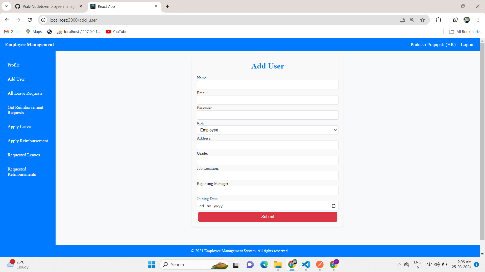
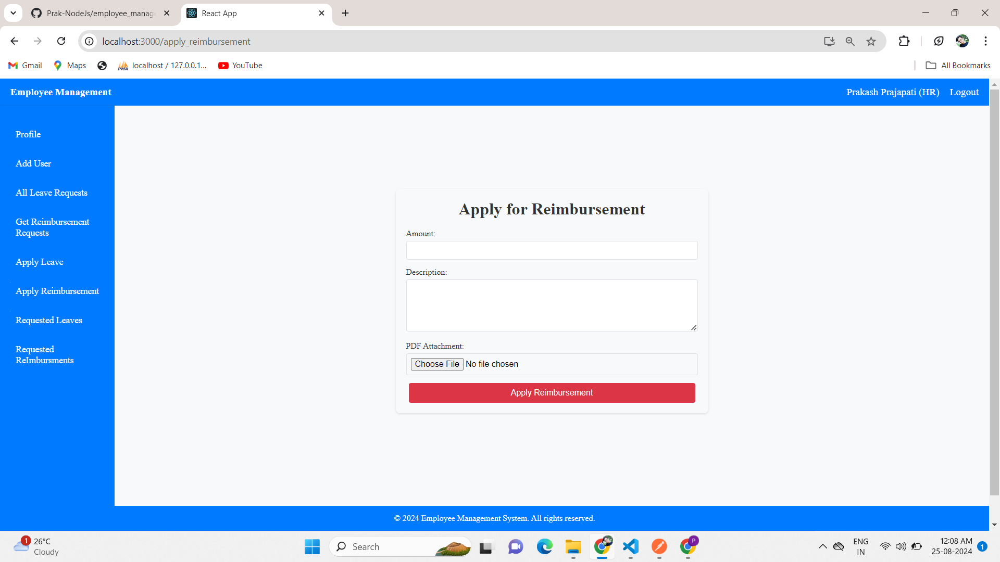
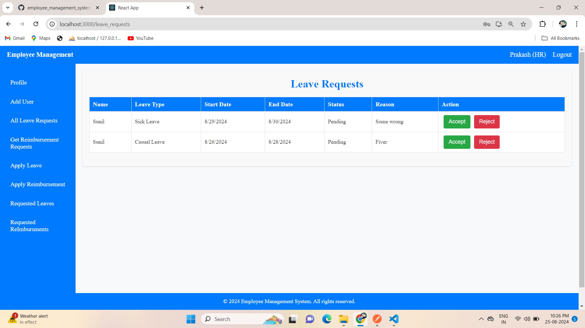

# Employee Management System

### Prerequisites

- Node.js (v14 or later)
- MySQL


### Features

1. **User Authentication**:
   - Both HR and Employee users can log in to the system using their credentials.

   

2. **Profile Management**:
   - Users can view their personal profiles, which include details like name, email, address, job location, and reporting manager.
   - All leaves details

   
   
   
3. **Employee and HR Management**:
   - HR users have the ability to add new employees as well as other HR users to the system.

   

4. **Leave Application**:
   - Both HR and Employee users can apply for leaves, specifying the start date, end date,reason and type of leave.
   - They can view their applied leaves, including details like leave type, status,reason and leave balance.

   
   


5. **Reimbursement Application**:
   - Both HR and Employee users can apply for reimbursements by submitting necessary details such as amount, description, and file attachments.
   - They can view their applied reimbursements with the status and attached files.

   
   

6. **Leave Balance Tracking**:
   - Users can track their available leave balance, the number of leaves taken, and the total leaves available.

   

7. **HR Dashboard**:
   - HR users can view all the requested leaves and reimbursements of employee users.
   - HR users can accept or reject leave requests and reimbursement requests of employee user.

   
   


### Installation

1. Clone the repository:
    ```bash
    git clone https://github.com/Prak-NodeJs/vistaar_task.git
    cd employee_management_system
    ```

2. Install dependencies for the server:
    ```bash
    cd Server
    npm install
    ```

3. Install dependencies for the client:
    ```bash
    cd Client
    npm install
    ```

4. Set up environment variables:
    - Copy the `sample_env.env` file to `.env` in the `Server` directory.
    - Update the `.env` file with the necessary environment variables.

    ```bash
    cp sample_env.env .env
    ```

    Open the `.env` file and configure your environment variables according to your setup.

5. Start the development servers:
    - For the server application:
      ```bash
      cd ./Server
      npm start
      ```
    - For the client application:
      ```bash
      cd ./Client
      npm start
      ```
  
6. Open your browser and navigate to `http://localhost:3000`.
